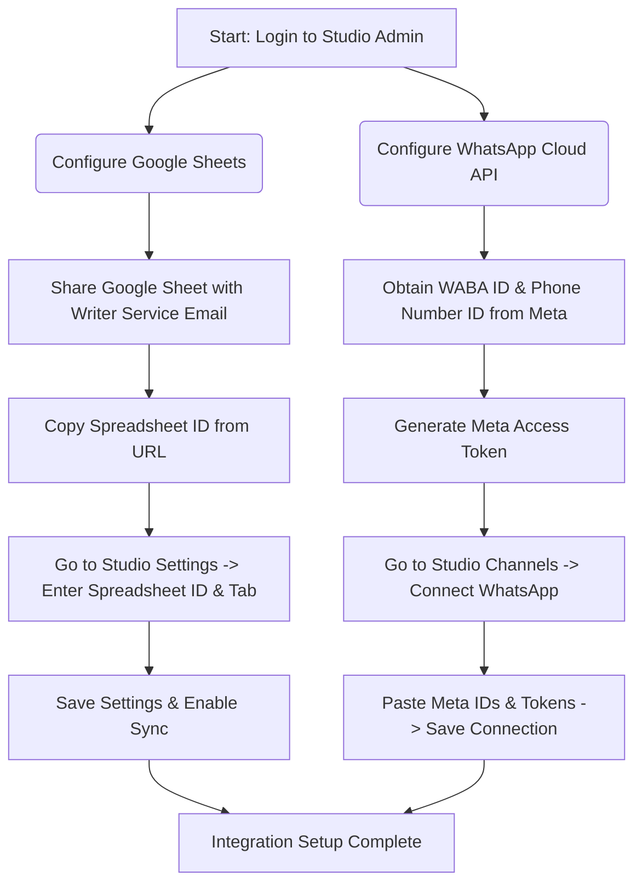
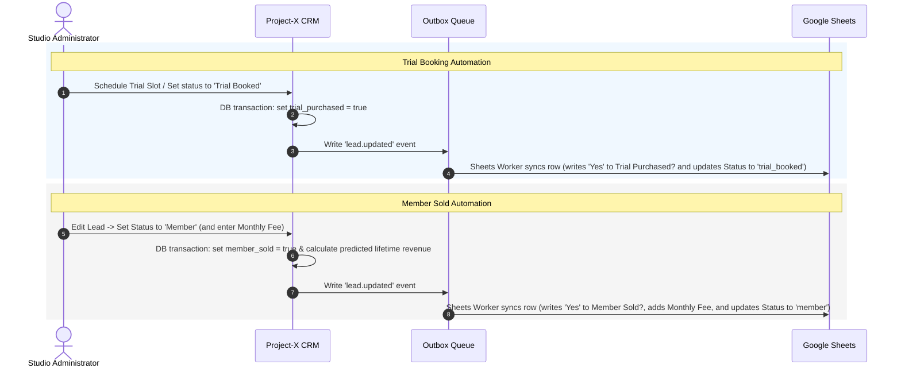

# Project-X: Studio Owner & Administrator Client Manual

Welcome to Project-X! This guide is designed to walk you (and your studio staff) through configuring and using the platform to capture, nurture, communicate with, and sync leads.

---

## 1. Setup & Integrations Flow

Below is the workflow showing the steps needed to connect all channels (WhatsApp + Google Sheets) to your Studio workspace:

---

## 2. Google Sheets Integration (Step-by-Step)

By connecting your studio to Google Sheets, any lead captured or modified in Project-X is instantly sent to your spreadsheet.

### Step 1: Share Your Spreadsheet
1. Open your target Google Spreadsheet in your browser.
2. Click the blue **Share** button in the top right.
3. Paste the following Project-X service email address:
   `studiox-sheets-writer@heroic-artifact-434914-d4.iam.gserviceaccount.com`
4. Set the role to **Editor** and click **Send**.

### Step 2: Copy the Spreadsheet ID
1. Look at your browser address bar when viewing your spreadsheet.
2. Copy the long code between `/d/` and `/edit`.
   * *Example*: In `https://docs.google.com/spreadsheets/d/1A2B3C4D5E6F7G8H9I0J/edit`, the ID is `1A2B3C4D5E6F7G8H9I0J`.

### Step 3: Link it in Project-X
1. Go to your Studio dashboard on Project-X.
2. Navigate to **Settings** from the sidebar.
3. Scroll to the **Google Sheets Sync** section.
4. Paste the **Spreadsheet ID** and enter the **Tab Name** (e.g. `Leads`).
5. Set the toggle to **Active** and click **Save**.

---

## 3. WhatsApp Meta Connection (Step-by-Step)

Connecting WhatsApp allows you to send automated template messages, follow up with leads, and receive replies in a unified studio inbox.

### Step 1: Gather Meta Details
Log in to your [Meta Developer Console](https://developers.facebook.com) and navigate to your WhatsApp dashboard:
1. Copy your **WhatsApp Business Account (WABA) ID**.
2. Copy your **Phone Number ID**.
3. Generate or copy your **System User Access Token** (encrypted at rest by our database).

### Step 2: Save the Channel
1. In Project-X, navigate to **Channels** from the sidebar.
2. Click **Connect WhatsApp**.
3. Paste your WABA ID, Phone Number ID, Display Phone Number, and Access Token.
4. Click **Connect**. The system will verify connection and turn on your WhatsApp channel.

---

## 4. Lead Pipeline & Automation Flow

Here is how the status transitions automatically trigger actions, update flags, and propagate records to Google Sheets:

### Lead Status Stages
*   **New**: A freshly imported or submitted lead.
*   **Contacted**: Follow-up has started.
*   **Trial Booked**: Scheduled a class (auto-sets `Trial Purchased` to `Yes`).
*   **Member**: Purchased a membership (auto-sets `Member Sold` to `Yes` and records the monthly price).
*   **Dropped**: Lead has opted out or failed to convert.

---

## 5. WhatsApp Templates & Variable Replacements

When messaging a lead, you can use templates to automatically populate custom fields. 

### Supported Template Variables
Our system parses and replaces variables dynamically before sending:

| Variable | Replaced With | Example |
| :--- | :--- | :--- |
| `{{contact.first_name}}` | Lead's First Name | "John" |
| `{{contact.last_name}}` | Lead's Last Name | "Doe" |
| `{{studio.name}}` | Studio Business Name | "Yoga Bliss Singapore" |

### How to Send a Template Message
1. Go to the **Inbox** page in Project-X.
2. Click on a conversation with a lead.
3. Click the **Send Template** icon at the bottom of the chat box.
4. Select a pre-approved Meta Template (e.g. `trial_class_reminder`).
5. Click **Preview & Send**. The variables will be replaced in real-time, sending a personalized message to the lead.

---

## 6. Frequently Asked Questions (FAQ)

#### Q: How long does it take for a status change in Project-X to appear in Google Sheets?
**A**: Less than 5 seconds. The outbox synchronization worker runs in the background and processes updates in near real-time.

#### Q: I changed a lead to 'Trial Booked', but 'Trial Purchased' in the sheet is still 'No'. Why?
**A**: Make sure the background worker is running and that your Google Sheet has been successfully shared with our Service Account email (`studiox-sheets-writer@heroic-artifact-434914-d4.iam.gserviceaccount.com`) as an **Editor**.

#### Q: What happens if a lead replies to a template message?
**A**: The reply will instantly pop up in your Project-X **Inbox**. Your staff can chat directly with the lead in real-time.
