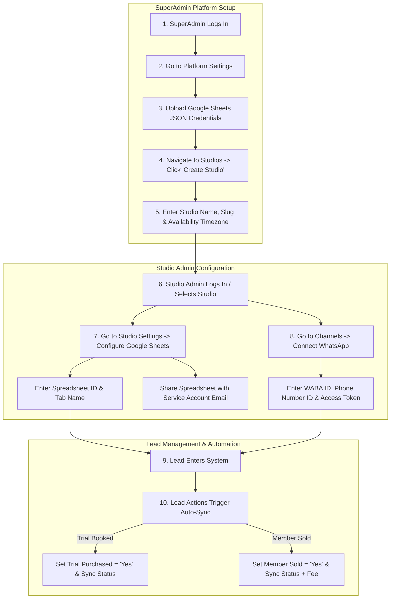

# Project-X: End-to-End Platform Setup & Administrator Client Manual

This manual details the step-by-step onboarding, setup, and lead management workflows in Project-X. It is divided into two parts: **SuperAdmin Platform Setup** and **Studio Admin Operations**.

---

## 1. Complete System Setup Flow

This diagram illustrates the full lifecycle: starting from platform initialization by the SuperAdmin, followed by Studio setup, channel connection, and finally day-to-day CRM lead management.



---

## 2. PART A: SuperAdmin Platform Setup (Step-by-Step)

The SuperAdmin configures the system-wide credentials and initializes new studio workspaces.

### Step 1: Login to the SuperAdmin Portal
1. Navigate to the login page of Project-X (e.g. `http://3.22.101.52/login`).
2. Enter the SuperAdmin credentials:
   * **Default Email**: `admin@example.com` (or your configured admin email).
3. Click **Sign In** to access the platform overview dashboard.

### Step 2: Configure System Google Credentials
1. Click on the **Settings** gear icon in the lower-left sidebar menu.
2. In the **Credentials Manager** card, click **Select JSON File**.
3. Upload your Google Cloud Service Account JSON key file.
4. Click **Save Credentials**. The system will reload the Google Sheets client instantly without requiring a server reboot.

### Step 3: Create a New Studio Workspace
1. Navigate to the **Studios** page in the sidebar.
2. Click the **Create Studio** button in the top right.
3. Fill in the required fields:
   * **Studio Name**: The user-friendly business name (e.g., `Yoga Bliss Singapore`).
   * **Slug**: The URL slug identifier (e.g., `yoga-bliss-singapore`). This determines the public scheduling and lead capture link.
   * **Timezone**: Set the operating timezone for booking slot scheduling.
4. Click **Create Studio**. The studio is now initialized and ready for its administrators.

---

## 3. PART B: Studio Admin Integration Setup

Once a studio is created, Studio Administrators configure their specific integration channels.

### Step 1: Connect Google Sheets
1. Log in to Project-X and open the Studio dashboard.
2. Open your target Google Spreadsheet in a separate browser tab.
3. Click the blue **Share** button (top right) and share the sheet with Project-X's service email:
   `studiox-sheets-writer@heroic-artifact-434914-d4.iam.gserviceaccount.com` as an **Editor**.
4. Copy the **Spreadsheet ID** from the browser address bar (the code between `/d/` and `/edit`).
5. In Project-X, go to **Studio Settings** (sidebar) -> scroll to **Google Sheets Sync**.
6. Paste the **Spreadsheet ID**, enter the **Tab Name** (e.g., `Leads`), set the toggle to **Active**, and click **Save**.

### Step 2: Connect Meta WhatsApp API
1. Navigate to **Channels** from the sidebar of your studio workspace.
2. Click **Connect WhatsApp**.
3. Retrieve your credentials from your Meta Developer WhatsApp settings:
   * **WABA ID**: WhatsApp Business Account ID.
   * **Phone Number ID**: WhatsApp Phone Number ID.
   * **Display Phone Number**: The public number formatted (e.g., `+1 555 645 5341`).
   * **Access Token**: Your Meta System User Token (encrypted at rest by our database).
4. Paste these details into the fields and click **Connect**.

---

## 4. PART C: Lead Management & Pipeline Automation

Day-to-day operations are automated so that staff actions in Project-X instantly sync to Google Sheets.

### Scenario A: Scheduling a Trial Slot
1. When a lead books a slot via your public booking page, or when an admin schedules a slot via the CRM lead profile page:
   * The database automatically sets `trial_purchased = true`.
   * An event is queued in the transactional `outbox`.
   * Within 5 seconds, the Google Sheet is updated: Column N (**Trial Purchased?**) switches to **`Yes`** and Column U (**Status**) updates to **`trial_booked`**.

### Scenario B: Enrolling a Member
1. When a lead decides to sign up, click **Edit Lead** on their CRM profile page.
2. Change their status dropdown to **Member**.
3. Enter their agreed **Monthly Fee** in the input field.
4. Click **Save**.
   * The database automatically flags `member_sold = true` and calculates the average predicted lifetime revenue.
   * The Google Sheet is updated: Column Q (**Member Sold?**) switches to **`Yes`**, Column R receives the **Monthly Fee**, and Column U (**Status**) updates to **`member`**.

---

## 5. Troubleshooting & FAQ

#### Q: The sync state says "Active", but updates aren't appearing in Google Sheets.
**A**: Ensure that the Google Sheet is shared with `studiox-sheets-writer@heroic-artifact-434914-d4.iam.gserviceaccount.com` as an **Editor**. If it is not shared, Google's API will reject write attempts.

#### Q: How can I check if the background sync worker is running?
**A**: A platform administrator can check container logs on the EC2 host with:
```bash
sudo docker compose logs -f api
```
Look for logs containing `sheets_worker` processing queue items.
